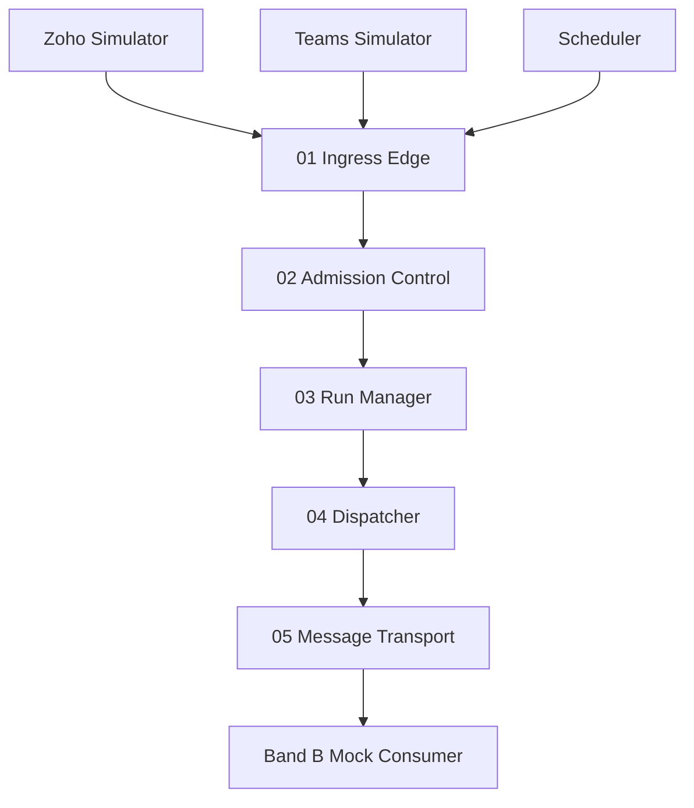

# Band A Local Emulator — Sales Lead Qualification

A fully local emulation of **Band A — Entry & Control** from the Agentic Systems Lab runtime blueprint. Demonstrates governed runtime entry for sales lead qualification without Azure, Zoho APIs, or Microsoft Teams.

## What This Project Is

An educational and architectural demo showing how work arrives from multiple channels, passes through deterministic Band A control (ingress → admission → run → dispatch → queue), and hands off to a mock Band B consumer.

## Business Use Case

**Sales Lead Qualification** — new leads arrive from Zoho (webhook), salespeople request qualification via Teams, or a scheduler sweeps pending leads. All paths converge into one Band A pipeline.

## What Band A Does

- Accepts and validates inbound work
- Authenticates callers and resolves tenants
- Deduplicates events and enforces run quotas
- Creates governed runs with metadata
- Dispatches sync or async (default: async)
- Enqueues durable messages for Band B

## What Band A Does NOT Do

- LLM inference or lead scoring
- Qualification decisions (`QUALIFIED` / `REJECTED`)
- CRM business reasoning
- Any AI judgment

## Three Entry Points

| Source | Simulator | Auth |
|---|---|---|
| Zoho | Create lead + webhook | HMAC signature (Ingress) + app JWT (Admission) |
| Teams | Natural language request | User JWT |
| Scheduler | Pending lead sweep | App JWT |

## Architecture



See [docs/PROJECT_GUIDE.md](docs/PROJECT_GUIDE.md) for the complete project explanation, [docs/architecture.md](docs/architecture.md) for component detail, and [docs/local-to-azure-mapping.md](docs/local-to-azure-mapping.md) for Azure mapping.

## How to Run Locally

### Quick start

```bash
cp .env.example .env
make install
make init
make dev
```

- **Frontend:** http://localhost:5173
- **Backend:** http://localhost:8000
- **API docs:** http://localhost:8000/docs

### Docker

```bash
docker compose up --build
```

## How to Use the UI

1. Select tenant (`company-a` or `company-b`)
2. **Zoho tab** — **New Lead → Band A** (create + webhook) or **Send Webhook** for an existing lead
3. **Teams tab** — Enter `Qualify lead LEAD-10001` and submit
4. **Scheduler tab** — Run Scheduler Now
5. Watch the animated Band A pipeline and event timeline
6. Toggle Mock Band B worker OFF to demo queue backlog
7. Use **Test Admission Controls** for rejection scenarios
8. **Reset Demo** restores seed state

## Demo Scenarios

| Scenario | How |
|---|---|
| Zoho happy path | Zoho tab → New Lead → Band A |
| Zoho resend / rejection | Queue → Worker OFF → Send Webhook twice for same lead |
| Teams happy path | Qualify lead via Teams tab |
| Scheduler sweep | Run Scheduler Now |
| Duplicate event | Test Admission → Duplicate |
| Invalid auth | Test Admission → Invalid Auth |
| Tenant mismatch | Test Admission → Wrong Tenant |
| Queue backlog | Worker OFF → create leads → Worker ON |
| Sync dispatch | Teams tab → Force sync checkbox |

## API Docs

Open http://localhost:8000/docs for interactive OpenAPI documentation.

Key endpoints:
- `POST /api/v1/ingress` — common Band A entry
- `POST /api/v1/dev/token` — local JWT for testing
- `GET /api/v1/runs/{run_id}/events` — timeline for UI

## Testing

```bash
make test
```

- Backend: pytest unit + integration tests
- Frontend: Vitest

## Local-to-Azure Mapping

| Local | Azure |
|---|---|
| FastAPI | API Management + Functions |
| JWT | Entra ID |
| SQLite | Azure SQL / Cosmos DB |
| SQLite queue | Service Bus |
| APScheduler | Logic Apps |

Full table in [docs/local-to-azure-mapping.md](docs/local-to-azure-mapping.md).

## Known Limitations

- Local JWT and HMAC secrets are for development only
- SQLite queue is single-process
- Mock Band B does not perform real qualification
- No external Zoho/Teams connectivity
- Polling-based UI updates (~1s), not WebSocket

## Project Structure

```
backend/          FastAPI + Band A services
frontend/         React dashboard
data/             SQLite DB + seed data
docs/             Architecture docs
prompt.md         Build specification
asl_band_a_diagram.html  Reference diagram
```
