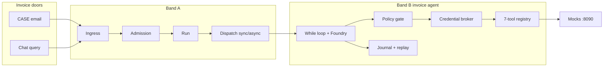

# Agentic Systems — Azure Emulator (Band A + Band B)

Local dual-mode runtime for the Agentic Systems Lab:

1. **Invoice Review** (Assignment 02 / Build 02) — Band A entry control + hand-rolled Band B agent loop against Azure AI Foundry; ERP/policy mocks on `:8090`
2. **Sales Lead Qualification** (Assignment 01 / Band A) — governed ingress → admission → run → dispatch → queue with a mock Band B consumer (no LLM)

The UI defaults to **Invoice Review**. Switch modes in the dashboard header.

## What runs locally vs cloud

| Piece | Where |
|---|---|
| Band A (ingress, admission, run, dispatch, queue) | Local FastAPI + SQLite |
| Band B invoice agent (while-loop, 7 tools, policy gate, broker, journal/replay) | Local |
| Mock ERP / extract / policy HTTP APIs | Local `:8090` |
| Model calls (`gpt-5-mini` via Foundry Responses API) | **Only cloud dependency** |
| Live Zoho / Teams / Azure Phase 5 | Deferred |

## Architecture (dual use case)



Sales Lead still uses Zoho / Teams / Scheduler → Band A → mock consumer (see [docs/PROJECT_GUIDE.md](docs/PROJECT_GUIDE.md)).

**Demo invariant:** email and chat are different *doors* (`arrival_source`), but the agent never sees which door was used. Same CASE can produce different tool order / verdicts; compare them in the UI.

## Prerequisites

- Python 3.11+ (project tested with 3.13 venv)
- Node.js 18+
- Azure CLI signed in (`az login`) for Foundry
- Foundry project + deployment (default model name: `gpt-5-mini`)

## Quick start

### 1. Configure env

```bash
cp .env.example .env
cp foundry/.env.example foundry/.env
# Edit foundry/.env:
#   FOUNDRY_PROJECT_ENDPOINT=https://<account>.services.ai.azure.com/api/projects/<project>
#   FOUNDRY_MODEL_NAME=gpt-5-mini
```

`.env` / `foundry/.env` are gitignored. The agent loads Foundry settings from `foundry/.env` when present.

### 2. Install + init DB

```bash
make install
make init
```

### 3. Start three processes

Invoice Review needs **mocks + API + UI** (not only `make dev`):

```bash
# Terminal 1 — mock ERP / extract / policy (port 8090)
cd services/mock_systems
../../backend/.venv/bin/python run_mocks.py

# Terminal 2 — API (port 8000)
cd backend
PYTHONPATH=. .venv/bin/python -m uvicorn app.main:app --reload --host 127.0.0.1 --port 8000

# Terminal 3 — UI (port 5173)
cd frontend && npm run dev -- --host 127.0.0.1 --port 5173
```

Or use `make backend` / `make frontend` for the last two; mocks are separate.

| Service | URL |
|---|---|
| UI | http://127.0.0.1:5173 |
| API + OpenAPI | http://127.0.0.1:8000 / http://127.0.0.1:8000/docs |
| Mocks | http://127.0.0.1:8090 |
| Invoice health | http://127.0.0.1:8000/api/v1/invoice/health |

Health strip in the UI polls API / mocks / model name.

### Docker

```bash
docker compose up --build
```

Compose starts backend + frontend only. For Invoice Review you still need mocks on the host (or extend compose) and Foundry credentials.

## Invoice Review — how to use the UI

1. Confirm health pills are green (API · Mocks :8090 · Model)
2. Prefer pinned cases: **CASE-03** (price variance), **CASE-06** (clean)
3. **Play CASE (email door)** — async or sync via Sync toggle
4. **Ask in chat** — same document, always sync, second run for compare
5. Open a run → finding (verdict, checks, budget) + expandable journal
6. **Demo: force policy block** — journals a real gate deny without a model call
7. **Replay journal** — climax should show **0 model calls · $0**
8. Expand the comparison table (Foundry vs what we built) for talk track

Assignment pack data lives under `Assignment_02_Pack/06_invoice_review_data/` (12 CASEs, expected verdicts, ERP fixtures).

## Sales Lead — how to use the UI

Switch dashboard mode to **Sales Lead**:

1. Select tenant (`company-a` or `company-b`)
2. Zoho / Teams / Scheduler tabs drive Band A (JWT + HMAC as before)
3. Pipeline animation + event timeline; Mock Band B worker toggle for queue backlog
4. **Reset Demo** restores seed leads (also clears invoice run state when used)

## Band B invoice agent (what we built)

| Piece | Implementation |
|---|---|
| Agent loop | Hand-rolled `while` on Foundry Responses API |
| Tool registry | Exactly 7: extract, PO, GRN, vendor, AP history, search/get policy |
| Connectors | HTTP to mocks `:8090` |
| Policy gate | Independent of the model (`policy_gate.py`) |
| Credential broker | HMAC-scoped mint after journaled intent |
| Journal + replay | SQLite turns; replay = no model calls |
| Budgets | Turns / USD cents / wall-clock on the run |

Inventory and §10 comparison: [docs/a02_inventory_and_comparison.md](docs/a02_inventory_and_comparison.md).

## Key API surface

**Invoice**

- `GET /api/v1/invoice/health`
- `GET /api/v1/invoice/cases`
- `POST /api/v1/invoice/cases/{case_id}/ingest?force_sync=`
- `POST /api/v1/invoice/chat/{case_id}`
- `GET /api/v1/invoice/runs` · `.../finding` · `.../journal` · `.../replay`
- `POST /api/v1/invoice/runs/{run_id}/demo/policy-block`

**Sales Lead / Band A**

- `POST /api/v1/ingress`
- `POST /api/v1/dev/token`
- `GET /api/v1/runs/{run_id}/events`

Full interactive docs: http://127.0.0.1:8000/docs

## Testing

```bash
make test
# Band B structural acceptance (T2, T3, T5–T8):
cd backend && PYTHONPATH=. .venv/bin/python -m pytest tests/test_band_b_acceptance.py -v

# Live invoice harness (needs API + mocks + Foundry):
backend/.venv/bin/python scripts/a02_acceptance.py
```

Audit notes: [docs/a02_audit_summary.md](docs/a02_audit_summary.md).

## Project structure

```
backend/                 FastAPI — Band A + Band B invoice agent
frontend/                React dashboard (Invoice Review | Sales Lead)
services/mock_systems/   Pack mocks launcher → :8090
Assignment_02_Pack/      Spec + CASE / ERP / policy fixtures
foundry/                 Foundry .env + smoke test
data/                    SQLite DB + seed leads
docs/                    Architecture, A02 inventory, audit
samples/                 Zoho / Teams sample payloads
scripts/                 a02_acceptance.py and helpers
```

## Docs

| Doc | Contents |
|---|---|
| [docs/PROJECT_GUIDE.md](docs/PROJECT_GUIDE.md) | Band A / Sales Lead deep dive |
| [docs/architecture.md](docs/architecture.md) | Component detail |
| [docs/local-to-azure-mapping.md](docs/local-to-azure-mapping.md) | Local → Azure mapping |
| [docs/a02_inventory_and_comparison.md](docs/a02_inventory_and_comparison.md) | Invoice inventory + Foundry comparison |
| [docs/AZURE_INVOICE_AGENT_PLAN.md](docs/AZURE_INVOICE_AGENT_PLAN.md) | Azure Phase 5 plan (deferred) |
| [foundry/README.md](foundry/README.md) | Foundry SDK setup |

## Known limitations

- Foundry is required for live invoice agent turns; without it, health still reports the configured model name
- Local JWT / HMAC / broker secrets are for development only
- SQLite queue and journal are single-process
- Sales Lead mock Band B does not score leads with an LLM
- No live Zoho CRM / Teams bot / ACA deployment in this repo yet
- UI updates via polling (~1s), not WebSockets
- `docker compose` does not start invoice mocks
