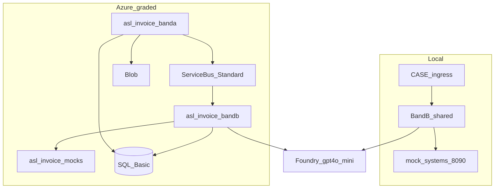

# Invoice Review Band A/B Plan — parallel local + Azure

**Programme:** Agentic Systems Lab · Assignment 02  
**Status:** Build-ready  
**Delivery mode:** **c** (local + Azure in parallel)  
**Model:** **gpt-4o-mini**  
**Region:** eastus2  
**Companion Cursor plan:** `~/.cursor/plans/azure_invoice_agent_59ce6c7c.plan.md`

Pricing figures are estimates — re-check the [Azure Pricing Calculator](https://azure.microsoft.com/pricing/calculator/).

---

## 0. What changed in this revision

- Delivery **b → c**: local agent iteration + Azure graded target
- Model **gpt-5 → gpt-4o-mini** (deploy in Foundry; call via Python SDK)
- Phases reordered: local Band B first; Azure infra parallel / next

---

## 1. Executive summary

| Decision | Choice |
|---|---|
| Delivery | **c** — local + Azure parallel |
| Agent loop | Hand-rolled on Foundry Responses API |
| Model | **gpt-4o-mini** |
| Local first slice | CASE email → finding vs `mock_systems` on :8090 |
| Azure graded path | Same Band B code → ACA + SQL Basic + Service Bus + Blob |
| Modes | `invoice_review` first; `sales_lead` later |
| Lab RG | `rg-asl-invoice` |
| Foundry | Reuse `anujthakur-3048` in `Ai-Agent` |

**Cost:** Local weeks ≈ model tokens only. Azure Scenario A infra **~$25–45/mo** + cheap mini tokens.

---

## 2. Locked facts

| Item | Value |
|---|---|
| Subscription | `0eb64859-ea04-452d-af53-90d2bee3b628` |
| User | `aditya.chowdhury@giantleapsystems.com` |
| Region | **eastus2** |
| Foundry account / project | `anujthakur-3048-resource` / `anujthakur-3048` |
| Endpoint | `https://anujthakur-3048-resource.services.ai.azure.com/api/projects/anujthakur-3048` |
| Model deployment | **`gpt-4o-mini`** (must be created — not present yet; `gpt-5` exists today) |
| How model is used | Python SDK `azure-ai-projects` — **not** deployed by Bicep |
| SQL | Azure SQL Database **Basic** (~$5/mo) |
| Naming prefix | `asl-invoice` |

---

## 3. Delivery mode c

| Track | Build | Purpose |
|---|---|---|
| Local | Band B + mocks + CASE path | Fast criteria iteration |
| Azure | Infra + Band A + same Band B | Graded demo + comparison table |

One agent codebase; config switches backends.

---

## 4. Model: gpt-4o-mini

1. Deploy in Foundry (Models + endpoints) on `anujthakur-3048-resource`.
2. Set `FOUNDRY_MODEL_NAME=gpt-4o-mini` in [`foundry/.env`](../foundry/.env) and app secrets.
3. Agent calls via `AIProjectClient.get_openai_client().responses.create(model=...)`.

Est.: ~$0.005–0.015 / run; 24 door-runs ≈ **$0.15–0.40**.

---

## 5. Architecture



| Need | Local | Azure |
|---|---|---|
| Mocks | `python mock_systems.py` :8090 | ACA `asl-invoice-mocks` |
| Queue | in-process / SQLite ok for dev | Service Bus Standard + DLQ |
| Runs / journal | SQLite or local SQL | Azure SQL **Basic** |
| Documents | local disk / folder | Blob |
| Model | Foundry gpt-4o-mini | same |

---

## 6. Repo layout

```text
azure/
  infra/          # Bicep
  band_a/
  band_b/         # Shared agent
  mock_systems/
  dashboard/
foundry/
backend/          # Sales Lead reference
Assignment_02_Pack/
```

---

## 7. Azure resource names (when Phase 2 runs)

| Resource | Name / SKU |
|---|---|
| RG | `rg-asl-invoice` |
| ACA env / A / B / mocks | `asl-invoice-cae` / `banda` / `bandb` / `mocks` |
| Service Bus | `asl-invoice-sb` Standard; queue `invoice-review` + DLQ (~$10/mo) |
| SQL | `asl-invoice-sql` / `asl_invoice` **Basic** (~$5/mo) |
| Blob | `aslinvoice*` / `documents` (~$1–3/mo) |
| Key Vault | `asl-invoice-kv` Standard (~$1–2/mo) |
| App Insights | `asl-invoice-appi` (~$2–5/mo) |

Cheaper SQL than Basic: Free offer if sponsorship still allows; otherwise Basic is the cheap paid floor.

---

## 8. Schemas / broker / tools

Unchanged from prior build-ready plan: Run, InboundEvent, JournalTurn, Finding; HMAC broker with `erp`|`extract`|`policy`; seven tools only (see Assignment pack README).

---

## 9. Phased delivery

| Phase | Work |
|---|---|
| **0** | Deploy gpt-4o-mini; local mocks :8090; Foundry smoke |
| **1** | Local Band B (loop, tools, gate, broker, journal); CASE→finding |
| **2** | Azure Bicep foundation (parallel OK) |
| **3** | Azure mocks + Band A; point Band B at Azure |
| **4** | Chat + UI |
| **5** | Live Zoho/Teams; sales_lead; criteria 1–10; demo |

---

## 10. Cost controls

1. Prefer local until agent loop is solid  
2. gpt-4o-mini only; loop caps  
3. When Azure is up: scale-to-zero ACA, SQL Basic, SB Standard, budget alerts $50/$100  

---

## 11. Out of scope

A03–A05 extras, LangChain/LangGraph, Premium SB/SQL, judgment-in-tools.

---

## 12. References

- [`Assignment_02_Pack/01_assignment_02.md`](../Assignment_02_Pack/01_assignment_02.md)  
- [`Assignment_02_Pack/06_invoice_review_data/README.md`](../Assignment_02_Pack/06_invoice_review_data/README.md)  
- [`foundry/README.md`](../foundry/README.md)  

---

*Revised: delivery mode c + gpt-4o-mini.*
