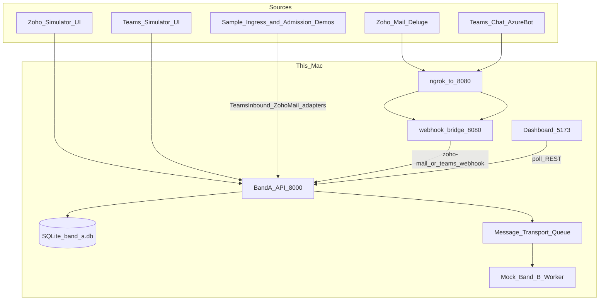

# Band A Local Emulator — Complete Project Guide

**Sales Lead Qualification · Entry & Control runtime (local)**  
Last updated: September 2026 (Scheduler admission demos, dual-track Demo Guide, live Zoho/Teams + sample player)

This document describes the **current** Band A Local Emulator: purpose, architecture, integrations (Zoho Mail + Microsoft Teams + sample ingress + admission demos), how to run and demo it, and how pieces map conceptually to Azure.

---

## Table of contents

1. [What this project is](#1-what-this-project-is)
2. [What Band A does and does not do](#2-what-band-a-does-and-does-not-do)
3. [Repository layout](#3-repository-layout)
4. [End-to-end architecture](#4-end-to-end-architecture)
5. [The Band A pipeline (stage by stage)](#5-the-band-a-pipeline-stage-by-stage)
6. [Entry points and adapters](#6-entry-points-and-adapters)
7. [Real Zoho Mail integration](#7-real-zoho-mail-integration)
8. [Real Microsoft Teams bot integration](#8-real-microsoft-teams-bot-integration)
9. [Sync vs async dispatch](#9-sync-vs-async-dispatch)
10. [Data model and run states](#10-data-model-and-run-states)
11. [Authentication and security](#11-authentication-and-security)
12. [Admission controls in detail](#12-admission-controls-in-detail)
13. [Frontend dashboard](#13-frontend-dashboard)
14. [API reference (key endpoints)](#14-api-reference-key-endpoints)
15. [Configuration and environment](#15-configuration-and-environment)
16. [How to start all services](#16-how-to-start-all-services)
17. [Demo scenarios](#17-demo-scenarios)
18. [Seed data and Reset Demo](#18-seed-data-and-reset-demo)
19. [Testing](#19-testing)
20. [Local → Azure mapping](#20-local--azure-mapping)
21. [Limitations](#21-limitations)
22. [Related docs](#22-related-docs)

---

## 1. What this project is

The **Band A Local Emulator** is a fully local educational/demo system that emulates **Band A — Entry & Control** from the Agentic Systems Lab runtime blueprint.

**Business use case:** Sales Lead Qualification.

Leads and qualification requests can arrive from:

| Channel | How it arrives locally |
|---|---|
| **Zoho CRM simulator** | Dashboard Zoho tab — create leads / send webhooks |
| **Zoho Mail (real)** | Email → Zoho Deluge → ngrok → webhook bridge → Band A |
| **Teams simulator** | Dashboard Teams tab — “Qualify lead LEAD-…” (optional Force sync) |
| **Teams bot (real)** | Microsoft Teams chat → Azure Bot → ngrok → webhook bridge → Band A |
| **Scheduler (sample ingress player)** | Dashboard Scheduler tab — fictional Teams/Zoho JSON samples through the **same** webhook adapters (manual or timer), plus **one-click admission failure demos** |

All paths **converge** into one Band A pipeline. There is no source-specific business logic after ingress normalization.

This project is **not** a production CRM, not Azure-hosted by default, and **not** an AI qualifier. It proves governed entry and control of work.

---

## 2. What Band A does and does not do

### Band A does

- Accept and validate inbound work
- Authenticate callers and resolve tenants
- Deduplicate events and enforce per-tenant run quotas
- Block a second **active** run for the same lead
- Create governed **runs** with timeline events
- Dispatch work **sync** (in-process) or **async** (queue)
- Hand off async work to a mock Band B consumer via a durable queue

### Band A does **not**

- LLM inference or lead scoring
- Full CRM qualification outcomes (sync Teams demo may set lead `QUALIFIED` for UX only)
- Replace Zoho CRM or Microsoft Teams
- Run real Azure Service Bus / Event Grid (those are mapped conceptually)

---

## 3. Repository layout

Root: `/Users/adityachowdhury/Desktop/Azure Emulator`

| Path | Role |
|---|---|
| `backend/` | FastAPI Band A API, Band B mock worker, sample ingress, admission demos (`services/admission_demos.py`), tests |
| `frontend/` | React + Vite dashboard (Demo Guide, Scheduler happy path + admission demos) |
| `samples/teams/` · `samples/zoho/` | Fictional JSON packs for the Scheduler sample player (~10 each) |
| `data/` | SQLite DB (`band_a.db`) and `seed_leads.json` (tests only) |
| `docs/` | Architecture and Azure mapping docs (this guide) |
| `scripts/` | Utilities (e.g. UI HTML snapshot generator) |
| `Makefile` | install / init / seed / dev / test / reset-demo |
| `docker-compose.yml` | Optional containerized backend + frontend |
| `.env` / `.env.example` | Runtime configuration |
| `README.md` | Quick start and overview |
| `prompt.md` | Original full build specification |
| `band-a-sales-bot.zip` | Teams app package for sideload (also under `~/Desktop/webhook/`) |

**Sibling project (required for real mail/Teams):**  
`/Users/adityachowdhury/Desktop/webhook`

| Path | Role |
|---|---|
| `server.js` | Express bridge on port **8080** (Zoho Mail forwarder) |
| `teamsBot.js` | Bot Framework `/api/messages` — forward messages + **Ingestion logs** Adaptive Card |
| `teams-app/` | Manifest, icons, `SETUP.md`; `npm run package-teams-app` rebuilds the zip |
| `.env` | Microsoft App ID/secret/tenant + bridge keys (never commit) |

---

## 4. End-to-end architecture



### Ports

| Service | Port | URL |
|---|---|---|
| Band A API | 8000 | http://127.0.0.1:8000/docs |
| Dashboard | 5173 | http://127.0.0.1:5173 |
| Webhook bridge | 8080 | http://127.0.0.1:8080/health |
| ngrok (public) | — | `https://<ngrok-host>` → localhost:8080 |

### Startup behavior

- API `startup`: `init_db()` only — **does not** seed stub leads
- Band B worker starts **OFF**
- Sample-player timer starts **OFF** until Start timer on the Scheduler tab

---

## 5. The Band A pipeline (stage by stage)

Every accepted request goes through `BandAOrchestrator.process()` in  
`backend/app/band_a/orchestrator.py`.

```text
Request
  → 01 INGRESS
  → 02 ADMISSION
  → 03 RUN MANAGER
  → 04 DISPATCHER
  → 05 MESSAGE TRANSPORT  (async only)
  → Band B mock consumer   (when worker ON)
```

### 01 Ingress Edge — `band_a/ingress.py`

**Job:** Receive the package, validate shape, optionally verify Zoho signature, store raw payload.

- Accepts sources: `zoho`, `teams`, `scheduler` (legacy mapping still exists)
- Maps event types to trigger types:
  - `lead_created` → `zoho_webhook`
  - `qualify_lead_request` → `teams_manual`
  - `scheduled_qualification` → `scheduler_sweep` *(legacy; live Scheduler UI no longer uses this path)*
- For Zoho: HMAC-SHA256 signature check
- Stores an `InboundEvent` row (or reuses one for the same `event_id`)
- Emits timeline events: `request_received`, `raw_payload_stored`, `acknowledged`

### 02 Admission Control — `band_a/admission_control.py`

**Job:** Bouncer. Decide whether this may become a run.

Five checks (in order):

1. **Authentication** — JWT claims present; role allowed for source  
2. **Tenant resolution** — token tenant must match request tenant  
3. **Deduplication** — same `event_id` already has a run → return existing run (`duplicate: true`), not an error  
4. **Active run guard** — lead already has a run in an active state → **409 ACTIVE_RUN_EXISTS**, no new run  
5. **Admission budget** — tenant active-run count vs quota  

Failures emit timeline `FAILED` / `rejected` events. Success continues.

### 03 Run Manager — `band_a/run_manager.py`

**Job:** Create the official run ticket.

- Allocates IDs like `RUN-2026-000011` using **max existing numeric suffix + 1** for the year (not row count — safe after Reset Demo deletes)
- Initial state: **`ADMITTED`**
- Links tenant, source, trigger, lead, correlation ID, inbound event
- If lead was `NEW`, moves it to `PENDING_QUALIFICATION`
- Supports **suspend** / **resume** for demo ops

### 04 Dispatcher — `band_a/dispatcher.py`

**Job:** Choose how work proceeds.

| Mode | Behavior | Typical end state |
|---|---|---|
| **Async** (default) | Enqueue to message transport; lead → `QUALIFICATION_IN_PROGRESS` | `QUEUED` until worker |
| **Sync** (`force_sync=True`) | Complete in-process; lead → `QUALIFIED` | `HANDED_OFF` |

Timeline shows either `async_selected` or `sync_selected` (+ `sync_complete` on sync).

### 05 Message Transport — queue tables + `band_b/mock_consumer.py`

Durable SQLite-backed queue (`sales-lead-qualification` by default).  
Messages: `PENDING` → `PROCESSING` → `COMPLETED` / `FAILED` / `DEAD_LETTER`.

When **Worker ON**, the mock Band B consumer drains the queue and marks runs **`HANDED_OFF`**. It does **not** score leads — it only proves handoff.

---

## 6. Entry points and adapters

| Entry | Adapter / service | Route / trigger | Dispatch |
|---|---|---|---|
| Zoho simulator create | `zoho_adapter.py` | `POST /api/v1/simulators/zoho/leads` | Async |
| Zoho simulator webhook | `zoho_adapter.py` | `POST /api/v1/simulators/zoho/webhook` | Async |
| Zoho Mail (real) | `zoho_mail_adapter.py` | `POST /api/v1/webhooks/zoho-mail` | Live invoice **sync Band B**; else sales lead |
| Teams simulator | `teams_adapter.py` | `POST /api/v1/simulators/teams/request` | Async unless `force_sync` |
| Teams bot (real) | `teams_inbound_adapter.py` | `POST /api/v1/webhooks/teams` | Sales lead **sync**; CASE invoice **async admit + background Band B** |
| Sample player | `sample_ingress.py` | `POST /api/v1/scheduler/ingest` · timer | Teams **sync** + Zoho **async** |
| Admission demos (Scheduler) | `admission_demos.py` | `POST /api/v1/scheduler/demos/{scenario}` | Varies by scenario (orchestrator) |

### Teams message parsing

`TeamsAdapter` accepts phrases like `Qualify lead LEAD-10001`.

Real Teams inbound (and sample Teams) also accept **free text**: create a new lead (`source=Teams`) and enter Band A.

### Zoho Mail parsing

`ZohoMailAdapter` normalizes Deluge/Flow shapes into `from`, `to`, `subject`, `body`, `message_id`, HTML-unescapes fields (so `&lt;email&gt;` becomes `<email>`), creates a lead (`source=Zoho Mail`), and enters Band A with a Zoho-signed payload.

### Sample player tagging

Sample ingest stamps `demo_origin=sample_player` (plus `channel_id=sample-ingress` / fictional `.example` addresses) so **Reset** can delete sample rows without wiping live bot/mail.

---

## 7. Real Zoho Mail integration

```text
Email to monitored inbox
  → Zoho Mail filter + Deluge script
  → HTTPS POST to ngrok …/webhook  (from/to/subject/content + attachments[])
  → Desktop webhook/server.js (port 8080)
  → Band A POST /api/v1/webhooks/zoho-mail  (header X-Mail-Bridge-Key)
  → IF .json/.txt attachment or body parses as pack-shaped invoice:
        store data/invoice_uploads/{document_ref}.json
        invoice_review → sync Band B (extract + ERP/policy mocks) · door zoho
     ELSE:
        store non_invoice payload (sentinel SUP-1001)
        invoice_review → sync Band B → finding exception:not_an_invoice · door zoho
  → Dashboard: Invoice Review (zoho door) + Received Email
```

**Live invoice contract:** attach pack `.json`/`.txt` (Deluge Script B downloads via Mail API) **or** paste pack JSON in the body. Must include `supplier_id`. No local `CASE-XX` mapping. Unrelated live mail is not a Sales Lead — use the dashboard Zoho simulator for that. See [docs/zoho_deluge_live_invoice.md](zoho_deluge_live_invoice.md).

**Required for live mail:** backend **and** webhook bridge **and** `ngrok http 8080` must all be running. Zoho cannot reach `127.0.0.1`. Free ngrok hostnames change on restart — update the Deluge invoke URL to `https://<ngrok-host>/webhook` each time (or use a reserved domain).

Confirm health:

- Bridge: http://127.0.0.1:8080/health  
- Band A mail webhook: http://127.0.0.1:8000/api/v1/webhooks/zoho-mail/health (`monitor_address` should match the inbox)  
- ngrok inspector: http://127.0.0.1:4040  

If mail never appears in the app, check the webhook terminal for `ZOHO MAIL WEBHOOK RECEIVED`. Silence there means Zoho never hit the tunnel (ngrok down or Deluge URL stale).

**Important:** ngrok must target **8080** (bridge), not 8000 (API).

Bridge already handles common Deluge pitfalls (multipart labeled as JSON, form-urlencoded, Map `.toString()` payloads) and forwards `attachments[]` for live extract.

Configure `MAIL_MONITOR_ADDRESS` and `MAIL_TENANT_ID` (default `company-a`).

---

## 8. Real Microsoft Teams bot integration

Personal Gmail Teams **cannot** host a custom bot. Use a **work Microsoft 365** tenant + Azure.

```text
User messages Band A Sales Bot in Teams (1:1 preferred for invoice demo)
  → Azure Bot Service
  → POST https://<ngrok>/api/messages
  → webhook/teamsBot.js (Bot Framework)
  → Band A POST /api/v1/webhooks/teams  (header X-Teams-Bridge-Key)

  IF text parses as pack-shaped invoice JSON (prose + JSON OK):
        store data/invoice_uploads/{document_ref}.json
        invoice_review · door teams
        → Band A returns run_id quickly (queued/dispatched)
        → BackgroundTasks runs Band B (Foundry)
        → bot acks run, polls finding, second message with verdict
  ELSE:
        invoice_review non_invoice · door teams (sentinel SUP-1001)
        → BackgroundTasks Band B → exception:not_an_invoice
        → (No live CASE-XX pack map; Play CASE in the UI. Sales Lead: dashboard simulator)
```

**Live Teams invoice contract:** paste pack JSON in the chat (must include `supplier_id`). Same parse rules as Zoho body. `CASE-XX` alone is treated as non-invoice — use the dashboard CASE player for pack fixtures.

**Required for live Teams:** backend **and** webhook bridge **and** `ngrok http 8080` must all be running. Free ngrok hostnames change on restart — update the Azure Bot messaging endpoint to `https://<ngrok-host>/api/messages` each time. Confirm: http://127.0.0.1:8080/health · http://127.0.0.1:8000/api/v1/webhooks/teams/health · ngrok inspector http://127.0.0.1:4040.

### Ingestion logs (Adaptive Card)

In-chat control (not the React dashboard):

| How | What happens |
|---|---|
| **View prompts** / command menu | Choose **Ingestion logs** |
| Type `ingestion logs` | Same fetch + card |
| Welcome / Refresh button | Adaptive Card `Action.Submit` / messageBack |

Flow: bot → `GET /api/v1/ingestion-logs?source=teams` (`X-Teams-Bridge-Key`) → Adaptive Card of Teams-inbound runs (Topic, Source+route, Band A stage, State, Spend —, Received IST, Note). Rows are **collapsed**; tap **Details** to expand. Does **not** create a new Band A run.

After changing the manifest, re-sideload `band-a-sales-bot.zip`. Bot JS changes only need a webhook restart.

### Azure / Teams setup (summary)

Full steps: `~/Desktop/webhook/teams-app/SETUP.md`

1. Entra app registration (single tenant) → App ID + Tenant ID + client secret **Value**
2. Azure Bot → Teams channel enabled
3. Messaging endpoint: `https://<ngrok-host>/api/messages`
4. Sideload `band-a-sales-bot.zip` into work Teams
5. Secrets in `~/Desktop/webhook/.env`

| Context | How to talk to the bot |
|---|---|
| Personal (1:1) | Type a message |
| Team channel | Must **@mention** the bot |

### Credentials (local webhook `.env`)

```env
MICROSOFT_APP_ID=...
MICROSOFT_APP_PASSWORD=...   # client secret Value
MICROSOFT_APP_TENANT_ID=...
MICROSOFT_APP_TYPE=SingleTenant
TEAMS_BRIDGE_KEY=local-teams-bridge-key
BAND_A_URL=http://127.0.0.1:8000
```

Never commit `.env`.

---

## 9. Sync vs async dispatch

| Path | Mode | Why |
|---|---|---|
| Zoho simulator / Zoho Mail | **Async** | Queue handoff to Band B |
| Teams simulator (default) | **Async** | Same |
| Teams simulator + Force sync | **Sync** | In-process demo |
| **Real Teams bot** | Sales lead **sync**; CASE invoice **async + bg Band B** | Chat UX — invoice avoids Bot Framework timeout |
| Sample player Teams samples | **Sync** | Same adapters as live Teams |
| Sample player Zoho samples | **Async** | Same adapters as live Zoho Mail |

**Sync:** timeline `sync_selected` → `HANDED_OFF`; no queue / worker needed.  
**Async:** `async_selected` + `enqueued` → stays `QUEUED` until Worker ON.

---

## 10. Data model and run states

Persistence: SQLite at `data/band_a.db` (from `DATABASE_URL`).

### Main tables

| Entity | Purpose |
|---|---|
| `Lead` | Sales lead record |
| `InboundEvent` | Raw ingress payload + metadata |
| `Run` | Governed unit of work |
| `RuntimeEvent` | Timeline / audit for UI |
| `QueueMessage` | Durable async handoff |

### Lead statuses

`NEW` → `PENDING_QUALIFICATION` → `QUALIFICATION_IN_PROGRESS` (async) or `QUALIFIED` (sync Teams path in this emulator).

### Run states

| State | Meaning |
|---|---|
| `ADMITTED` | Created after admission |
| `DISPATCHED` | Sent toward Band B |
| `QUEUED` | Waiting in message transport |
| `HANDED_OFF` | Sync complete or Band B consumed |
| `SUSPENDED` / `FAILED` / `REJECTED` | Ops / error paths |

### Active run states (block new runs for same lead)

```text
RECEIVED, ADMITTED, DISPATCHED, QUEUED, SUSPENDED
```

`HANDED_OFF` and `FAILED` do **not** block a new run. The Leads table still shows the **latest** run ID with a `(done)` label when there is no active run.

### Tenant quotas (active runs)

| Tenant | Default quota |
|---|---|
| `company-a` | 100 |
| `company-b` | 50 |
| unknown | 10 |

---

## 11. Authentication and security

| Mechanism | Used by | Details |
|---|---|---|
| **JWT (HS256)** | Simulators / admission | `sub`, `tenant_id`, `role`, `aud` (`band-a-local`) |
| **Dev token** | UI / tests | `POST /api/v1/dev/token` |
| **Zoho HMAC** | Zoho ingress | `ZOHO_WEBHOOK_SECRET` |
| **Mail bridge key** | Zoho Mail webhook | `X-Mail-Bridge-Key` |
| **Teams bridge key** | Teams webhook + ingestion-logs | `X-Teams-Bridge-Key` |

### Role ↔ source rules

| Source | Allowed roles |
|---|---|
| `zoho` | `zoho-simulator` |
| `teams` | `sales-user`, `teams-sales-user`, or roles starting with `sales` |
| `scheduler` | `scheduler` (legacy sweep path) |

Bridge adapters inject synthetic claims (mail → `zoho-simulator`; teams → `sales-user`) so admission runs without end-user JWTs from Zoho/Teams.

---

## 12. Admission controls in detail

**Primary presenter path:** Scheduler tab → **Admission failure demos** (open by default).  
Implementation: `backend/app/services/admission_demos.py` → `POST /api/v1/scheduler/demos/{scenario}`.

| UI title | Scenario id | What it proves | Typical codes / notes |
|---|---|---|---|
| Invalid auth | `invalid-auth` | Missing identity → rejected, no run | `AUTHENTICATION_FAILED` |
| Tenant mismatch | `tenant-mismatch` | Token tenant ≠ request tenant → rejected | `TENANT_MISMATCH` |
| Duplicate event_id | `duplicate` | Same stable `event_id` twice → idempotent same `run_id` | `duplicate: true` (not an error) |
| Active run blocked | `active-run` | Second async request while lead still has a `QUEUED` run → rejected | `ACTIVE_RUN_EXISTS`; **auto-stops Band B worker** if it was ON |
| Quota exceeded | `quota-exceeded` | Tenant active-run budget full → rejected | `BUDGET_EXCEEDED` for **company-b** |

### How the one-click demos are set up

| Scenario | Setup leads / runs |
|---|---|
| Auth / tenant / dup / active | Fixed `LEAD-DEMO-*` leads (`@demo.example`) so Reset can purge them |
| Active run | Clears prior active runs on `LEAD-DEMO-ACTIVE`, creates first Zoho async run left `QUEUED`, second request rejects |
| Quota | Fills **active** budget with `RUN-FILL-*` `QUEUED` runs on **`LEAD-DEMO-QUOTA-FILL`**, then requests a **different** lead **`LEAD-DEMO-QUOTA`** so the gate is budget (not active-run on the same lead) |

Presenter response shape includes: `scenario`, `outcome`, `message`, `run_id`, `rejected`, `duplicate`, `run_created`, plus `code` / `reason` / `worker_stopped` / `quota` when relevant.

Dashboard banners: **error** for rejects (no auto-dismiss), **info** for duplicates, **success** otherwise. Quota banner reminds you to Reset afterward. Queue panel shows an active-run Worker hint after that demo.

### Legacy fallback — Test Admission Controls

Bottom-of-page buttons still call `POST /api/v1/demo/admission/{invalid-auth|tenant-mismatch|duplicate|quota-exceeded}` (**no** `active-run` shortcut). Prefer the Scheduler demos for presenting. Legacy quota fills older seed-style lead IDs and is less self-contained on a clean DB.

### Manual active-run rejection (still valid)

1. **Worker OFF** (keeps first run `QUEUED`)
2. Zoho tab → pick one lead → **Send Webhook**
3. Send Webhook again for the **same** lead  
4. Second call → **409** `ACTIVE_RUN_EXISTS`  
5. Banner + timeline: `active_run_blocked`, `rejected`

**Note:** “New Lead → Band A” creates a **new lead ID every click** — happy path, not a resend test.

---

## 13. Frontend dashboard

Stack: React + Vite + Tailwind. Main page: `frontend/src/pages/Dashboard.tsx`.

### Major UI sections

1. **Header** — tenant switcher (`company-a` / `company-b`), **Reset Demo**
2. **Demo Guide** — dual-track presenter checklist (optional live Zoho/Teams + Scheduler); Click / Say / Expect; **Go to tab**; checkboxes persist in `localStorage`
3. **Summary** — leads, active runs, queued, handoffs, rejected, failed — filter **All / Zoho Mail / Teams**
4. **Entry Points** — Zoho / Teams / **Scheduler** tabs
5. **Band A Pipeline** — animated stages from runtime events
6. **Watch Run** — selected run summary
7. **Inbound panels** — Received Email (Zoho) and/or Received Message (Teams)
8. **Event Timeline** — stage actions (times in **IST**)
9. **Queue** — **pending-only** table (Run ID → Run Detail, Lead, Source, Status, Enqueued IST) + Worker ON/OFF (+ hint after Active-run admission demo)
10. **Test Admission Controls** — legacy fallback (prefer Scheduler demos)
11. **Leads table** — **Run** column = `active_run_id` or `latest_run_id` (completed runs show `(done)`); links to Run Detail; hover shows **×** to hard-delete that displayed run (confirm dialog; cascades events/queue/inbound; **if no runs remain, the lead is deleted too**)

### Demo Guide (dual-track)

`frontend/src/components/DemoGuidePanel.tsx` — steps `1`, `2` (optional live), `3` happy path, `4a`–`4e` admission demos, `5` queue, `6` reset. Subtitle: live Zoho/Teams + Scheduler. Primary click targets are Scheduler admission demos, not the legacy buttons.

### Scheduler tab (sample ingress player)

Catalog: `samples/teams/*.json` and `samples/zoho/*.json` (**Happy path** catalog closed by default; **Admission failure demos** open by default).

| Control | Behavior |
|---|---|
| **Happy path — sample catalog** | Multi-select → **Ingest selected** via real Teams/Zoho Mail adapters |
| **Timer** | Interval (seconds) + independent **Teams N** + **Zoho N** (either may be 0; sum ≥ 1). Each tick ingests next unused samples; **Pause** stops; auto-pauses when a channel with N>0 cannot be filled. UI default interval **15s**; API default if called raw is **30s** |
| **Admission failure demos** | Five rows (title, “Say: …”, **Run**). Drives banners + Watch run when a `run_id` exists. See §12 |
| **Reset player + demo** | Clears used/cursor, pauses timer, same DB wipe as Reset Demo |

Each ingest uses a unique `activity_id` / `messageId` and tags `demo_origin=sample_player`.

**Recommended live + Scheduler demo order** (matches Demo Guide): optional live Zoho Mail → optional live Teams bot → Scheduler happy-path ingest → all five admission demos → queue backlog (Worker OFF→ON) → Reset player + demo (live preserved).

### Live updates (polling)

`frontend/src/hooks/usePolling.ts`:

- Metrics / queue / leads+runs: ~2s  
- Watched run / events / inbound: **500ms** while in progress, else ~3s  
- New runs (mail, Teams, samples) auto-select into Watch run + banner  

Banners: success/info auto-dismiss ~5s; **error** stays until Dismiss.

Run detail: `frontend/src/pages/RunDetail.tsx` — `PipelineAnimation` above the Event Timeline.

Timestamps: API returns UTC with `Z`; UI formats **IST (Asia/Kolkata)** via `frontend/src/utils/datetime.ts`.

---

## 14. API reference (key endpoints)

Base: `http://127.0.0.1:8000`

### Core Band A

| Method | Path | Notes |
|---|---|---|
| GET | `/api/v1/health` | Liveness |
| POST | `/api/v1/ingress` | Generic ingress |
| GET | `/api/v1/leads` | Includes `active_run_id`, `latest_run_id` |
| GET | `/api/v1/leads/{lead_id}` | |
| POST | `/api/v1/leads` | |
| GET | `/api/v1/runs` | |
| GET | `/api/v1/runs/{run_id}` | |
| DELETE | `/api/v1/runs/{run_id}` | Hard-delete run + related `runtime_events`, `queue_messages`, and unreferenced `inbound_event`. If the lead has **no remaining runs**, deletes remaining inbound for that lead and the **lead** itself (`lead_deleted: true`). Used by Leads hover × |
| GET | `/api/v1/runs/{run_id}/events` | |
| GET | `/api/v1/runs/{run_id}/inbound-mail` | Headers HTML-unescaped on read |
| GET | `/api/v1/runs/{run_id}/inbound-teams` | |
| GET | `/api/v1/runs/{run_id}/queue-message` | |
| POST | `/api/v1/runs/{run_id}/suspend` · `/resume` | |

### Queue & metrics

| Method | Path |
|---|---|
| GET | `/api/v1/queue/status` · `/messages` |
| POST | `/api/v1/queue/worker/start` · `/stop` |
| GET | `/api/v1/metrics/summary?source_filter=all\|zoho_mail\|teams` |

### Simulators & demo

| Method | Path | Notes |
|---|---|---|
| POST | `/api/v1/dev/token` | |
| POST | `/api/v1/simulators/zoho/leads` · `/webhook` | |
| POST | `/api/v1/simulators/teams/request` | |
| POST | `/api/v1/dispatch/demo-sync` | |
| POST | `/api/v1/demo/reset` | Same purge rules as scheduler reset |
| POST | `/api/v1/demo/admission/{invalid-auth\|tenant-mismatch\|duplicate\|quota-exceeded}` | **Legacy** (no `active-run`) |

### Sample ingress & admission demos (Scheduler) — **primary presenter APIs**

| Method | Path | Notes |
|---|---|---|
| GET | `/api/v1/scheduler/samples` | |
| POST | `/api/v1/scheduler/ingest` | `{ teams_ids, zoho_ids }` |
| POST | `/api/v1/scheduler/timer/start` | `{ interval_seconds, batch_teams, batch_zoho }` |
| POST | `/api/v1/scheduler/timer/pause` | |
| GET | `/api/v1/scheduler/status` | remaining, used, last tick, etc. |
| POST | `/api/v1/scheduler/reset` | player reset + demo reset |
| GET | `/api/v1/scheduler/demos` | Catalog of admission failure demos |
| POST | `/api/v1/scheduler/demos/{scenario}` | `invalid-auth` · `tenant-mismatch` · `duplicate` · `active-run` · `quota-exceeded` |
| POST | `/api/v1/scheduler/start` · `/stop` | Compat aliases for timer |

### Real bridges

| Method | Path | Auth |
|---|---|---|
| POST | `/api/v1/webhooks/zoho-mail` | `X-Mail-Bridge-Key` |
| GET | `/api/v1/webhooks/zoho-mail/health` | — |
| POST | `/api/v1/webhooks/teams` | `X-Teams-Bridge-Key` |
| GET | `/api/v1/webhooks/teams/health` | — |
| GET | `/api/v1/ingestion-logs?source=teams` | `X-Teams-Bridge-Key` |

### Webhook bridge (8080)

| Method | Path |
|---|---|
| GET | `/health` |
| POST | `/webhook` | Zoho Mail forwarder |
| POST | `/api/messages` | Teams Bot Framework |

OpenAPI: http://127.0.0.1:8000/docs

---

## 15. Configuration and environment

### Emulator `.env` (project root)

See `.env.example`. Important keys:

```env
DATABASE_URL=sqlite:///../data/band_a.db
JWT_SECRET=...
JWT_AUDIENCE=band-a-local
ZOHO_WEBHOOK_SECRET=...
TENANT_QUOTA_COMPANY_A=100
TENANT_QUOTA_COMPANY_B=50
QUEUE_NAME=sales-lead-qualification
MAIL_BRIDGE_KEY=local-mail-bridge-key
MAIL_TENANT_ID=company-a
MAIL_MONITOR_ADDRESS=aditya.chowdhury@giantleapsystems.com
TEAMS_BRIDGE_KEY=local-teams-bridge-key
TEAMS_TENANT_ID=company-a
CORS_ORIGINS=http://localhost:5173,http://127.0.0.1:5173
```

`SCHEDULER_INTERVAL_SECONDS` / `SCHEDULER_ENABLED` may appear in `.env.example` but **do not** drive the live Scheduler sample-player timer — interval comes from the UI / `POST /scheduler/timer/start`.

### Webhook `.env` (`~/Desktop/webhook/.env`)

```env
PORT=8080
BAND_A_URL=http://127.0.0.1:8000
MAIL_BRIDGE_KEY=local-mail-bridge-key
TEAMS_BRIDGE_KEY=local-teams-bridge-key
MICROSOFT_APP_ID=...
MICROSOFT_APP_PASSWORD=...
MICROSOFT_APP_TENANT_ID=...
MICROSOFT_APP_TYPE=SingleTenant
```

Bridge keys must match the emulator `.env`.

---

## 16. How to start all services

### Terminal 1 — Backend

```bash
cd "/Users/adityachowdhury/Desktop/Azure Emulator/backend"
PYTHONPATH=. .venv/bin/python -m uvicorn app.main:app --host 127.0.0.1 --port 8000
```

### Terminal 2 — Webhook bridge

```bash
cd ~/Desktop/webhook
npm start
```

### Terminal 3 — Frontend

```bash
cd "/Users/adityachowdhury/Desktop/Azure Emulator/frontend"
npm run dev -- --host 127.0.0.1 --port 5173
```

### Terminal 4 — ngrok (required for real Zoho Mail / Teams)

```bash
ngrok http 8080
```

Copy the HTTPS URL from the ngrok UI (http://127.0.0.1:4040) or CLI:

- Zoho Deluge → `https://<host>/webhook`
- Azure Bot messaging endpoint → `https://<host>/api/messages`

If the ngrok hostname changes, update Azure Bot messaging endpoint, Zoho Deluge URL, and Teams manifest `validDomains` (repackage zip if needed). Without ngrok, live mail/Teams never reach the bridge even when backend + webhook are healthy.

### Or via Makefile

```bash
cd "/Users/adityachowdhury/Desktop/Azure Emulator"
cp .env.example .env
make install && make init && make dev
```

---

## 17. Demo scenarios

Preferred path: **live Zoho + Teams** (if bridges + ngrok ready) **and** Scheduler happy path + admission demos. Follow the in-app **Demo Guide**.

| # | Scenario | Steps | Expect |
|---|---|---|---|
| 1 | Live Zoho Mail (optional) | Attach/paste pack invoice JSON or free-text sales mail | invoice `door:zoho` + finding, or sales lead |
| 2 | Live Teams (optional) | Paste pack invoice JSON in bot chat, or free text | invoice `door:teams` + verdict follow-up (JSON) or `exception:not_an_invoice` |
| 3 | Sample ingress | Scheduler → happy path catalog → Ingest / Start timer | Teams sync + Zoho async runs |
| 4a | Invalid auth | Scheduler → Admission failure demos → Invalid auth | rejected, no run |
| 4b | Tenant mismatch | Scheduler → Admission failure demos → Tenant mismatch | rejected, no run |
| 4c | Duplicate event_id | Scheduler → Admission failure demos → Duplicate | same run_id twice |
| 4d | Active-run reject | Scheduler → Active run blocked (worker auto-stopped) | `ACTIVE_RUN_EXISTS` + banner + Watch run |
| 4e | Quota exceeded | Scheduler → Quota exceeded | `BUDGET_EXCEEDED`; Reset after |
| 5 | Queue backlog | Worker OFF → work → Worker ON | pending then drains |
| 6 | Clean slate | Reset Demo or Reset player + demo | Samples/simulators/`LEAD-DEMO-*` gone; live Zoho/Teams kept |

Legacy **Test Admission Controls** remain as a fallback (no active-run shortcut there).

---

## 18. Seed data and Reset Demo

- Stub seed leads (`data/seed_leads.json`) load in **tests only** — not on API startup.
- Live UI shows real Zoho Mail / Teams inbound plus simulator and sample-player activity until reset.

### What Reset does

Both **Reset Demo** (`POST /api/v1/demo/reset`) and **Reset player + demo** (`POST /api/v1/scheduler/reset`):

1. Stop Band B worker (demo reset) / pause sample timer + clear catalog used flags + stop worker (scheduler reset)
2. Delete simulator / stub / **sample-player** / **admission-demo** leads, runs, inbound events, queue messages, runtime events
3. **Preserve** real live `Zoho Mail` / `Teams` leads that are **not** sample-player
4. Do **not** re-seed stubs
5. Summary filters and Leads table then reflect only remaining data

### Treated as purgeable (sample / demo)

| Marker | Examples |
|---|---|
| Lead id prefix | `LEAD-DEMO-*` (admission demos, including `LEAD-DEMO-QUOTA-FILL`) |
| Fill runs | `RUN-FILL-*` (quota demo budget fillers) |
| Payload tag | `demo_origin=sample_player` |
| Teams sample channel | `sample-ingress`, `sample-conv-*` |
| Fictional mail | addresses ending in `.example` / `.local` (Zoho Mail sample/demo) |
| Sample catalog ids | sample JSON id prefixes used by the player |

Live Teams often uses `@teams.local` too — without sample inbound markers those leads are **preserved**.

---

## 19. Testing

### Backend

```bash
cd backend
PYTHONPATH=. .venv/bin/pytest -q
```

Covers admission (including Scheduler demos + reset purge of `LEAD-DEMO-*` / `RUN-FILL-*`), Zoho/Teams webhooks, sample ingress, reset purge vs live preserve, run ID generation, ingestion logs, auth.

### Frontend

```bash
cd frontend
npm test -- --run
```

---

## 20. Local → Azure mapping

| Local piece | Azure analogue |
|---|---|
| FastAPI ingress | API Management / Function ingress |
| Admission rules | Policy + identity (Entra) |
| Run Manager | Durable orchestration / custom run store |
| Message Transport (SQLite) | Service Bus / Storage Queue |
| Mock Band B | Azure Function / Container App consumer |
| Sample ingress timer | Logic Apps / Timer Function / Event Grid schedule |
| ngrok + webhook bridge | Public HTTPS / Azure Bot webhook |
| JWT + bridge keys | Managed Identity / Key Vault |
| Leads hover `DELETE /runs/{id}` | Guarded admin purge or omit (local demo ops) |

See also `docs/local-to-azure-mapping.md`.

---

## 21. Limitations

- Not multi-region / HA  
- SQLite is single-node demo storage  
- Mock Band B does not qualify leads  
- Teams channel bots require @mention  
- Personal Gmail Teams cannot host the custom bot  
- Free ngrok URLs change on restart — update Azure Bot + Zoho Deluge; without ngrok live mail/Teams never arrive  
- Real Teams path is **sync** by design; Zoho Mail stays **async**  
- Legacy `SchedulerAdapter` pending-lead sweep code may still exist in-repo but is **not** the live Scheduler UI  
- Legacy `/demo/admission/*` buttons remain but Scheduler demos are the presenter path  

---

## 22. Related docs

| Document | Contents |
|---|---|
| [README.md](../README.md) | Quick start |
| [docs/architecture.md](architecture.md) | Component diagram and Band B boundary |
| [docs/local-to-azure-mapping.md](local-to-azure-mapping.md) | Cloud mapping notes |
| [prompt.md](../prompt.md) | Original build specification |
| [~/Desktop/webhook/teams-app/SETUP.md](../../webhook/teams-app/SETUP.md) | Azure Bot + Teams sideload |

---

## Quick mental model

> **Band A is the post office and security gate for sales lead work.**  
> Sources drop packages in (Zoho, Teams, sample player, real mail, real bot).  
> Ingress logs them. Admission checks identity, duplicates, active runs, and quotas.  
> Run Manager opens a ticket (`RUN-{year}-{max+1}`). Dispatcher queues (async) or finishes sync.  
> Band B (mock) only proves the handoff — it does not decide if the lead is good.  
> Scheduler demos one-click the five admission failures; Reset keeps **live** Zoho Mail / Teams and clears simulators + sample-player + `LEAD-DEMO-*` clutter.
