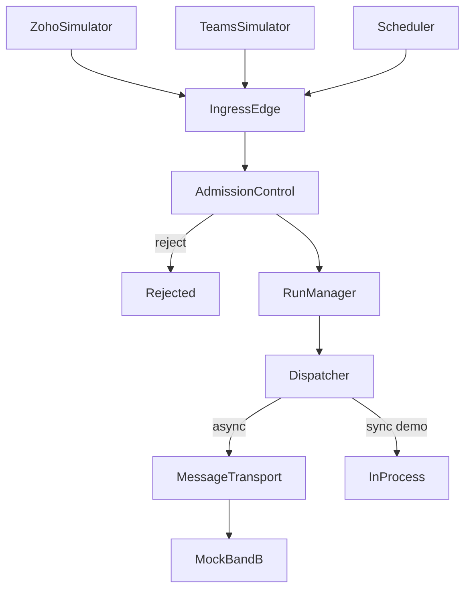

# Band A Local Emulator — Architecture

## Overview

This project emulates **Band A — Entry & Control** from the Agentic Systems Lab runtime blueprint for a single use case: **Sales Lead Qualification**.

Band A sits between "something arrived" and "a governed run is on its way." It contains no AI, no lead scoring, and no business reasoning.

## Components

| # | Component | Module | Responsibility |
|---|---|---|---|
| 01 | Ingress Edge | `band_a/ingress.py` | Validate envelope, verify Zoho HMAC, store raw event |
| 02 | Admission Control | `band_a/admission_control.py` | Auth, tenant, dedup, quota |
| 03 | Run Manager | `band_a/run_manager.py` | Create run, suspend/resume |
| 04 | Dispatcher | `band_a/dispatcher.py` | Sync vs async routing |
| 05 | Message Transport | `band_a/message_transport.py` | SQLite-backed durable queue |

## Convergence

All three entry points (Zoho, Teams, Scheduler) call `BandAOrchestrator.process()` — one pipeline, no source-specific business logic.

## Band B Boundary

`band_b/mock_consumer.py` consumes queue messages and marks runs `HANDED_OFF`. It proves the handoff only; it does not qualify leads.

## Data Flow

## Persistence

SQLite database at `data/band_a.db` stores leads, inbound events, runs, runtime events, and queue messages.

## UI

React dashboard polls backend every ~1 second to animate the pipeline and event timeline.
