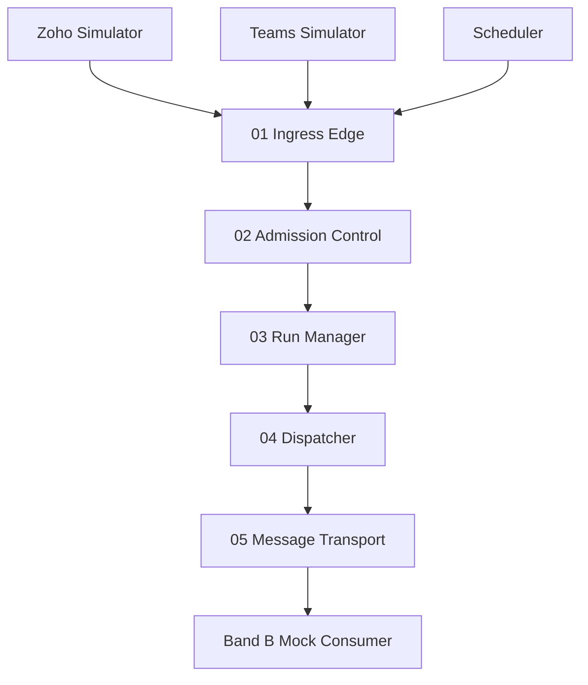

# Cursor Build Prompt — Local Emulation of Band A for Sales Lead Qualification

## 0. Role and objective

You are an expert full-stack/backend engineer building a **fully local emulation** of an enterprise agentic-runtime architecture called **Band A — Entry & Control**.

Implement the project described below as a working local application. Do **not** use Azure, Zoho APIs, Microsoft Teams APIs, paid cloud services, or external infrastructure. Everything must run on a developer laptop with local processes/containers only.

The application must demonstrate one business use case only:

> **Sales Lead Qualification**

There are exactly three ingestion/entry points for this use case:

1. **Zoho** — simulates an automatic new-lead event/webhook.
2. **Teams** — simulates a salesperson manually asking the system to qualify a lead.
3. **Scheduler** — simulates a recurring job that finds pending/unqualified leads and submits them for qualification.

All three entry points MUST converge into the **same Band A pipeline**. Do not create three separate business pipelines.

Band A is only the governed runtime entry/control layer. It must not perform AI reasoning or actually qualify the lead. Band A's job is to receive work, authenticate/admit it, create a run, dispatch it, and place asynchronous work onto a local message transport. A later placeholder **Band B** consumer may simulate the downstream handoff, but Band B must remain clearly separated from Band A.

The implementation should be polished enough to demonstrate the architecture to a technical reviewer and simple enough for someone unfamiliar with the architecture to understand from the UI.

---

## 1. Architectural source of truth

Use the following five Band A components as the authoritative structure:

1. **Ingress Edge**
2. **Admission Control**
3. **Run Manager**
4. **Dispatcher**
5. **Message Transport**

The reference blueprint describes Band A as everything between “something arrived” and “a governed run is on its way.” It explicitly states there is no model, no agent, and no judgment in Band A; every component is deterministic code.

The reference flow is:

```text
Arrival sources
    ↓
01 Ingress Edge
    ↓
02 Admission Control
    ↓
03 Run Manager
    ↓
04 Dispatcher
    ↓
   Sync OR Async
          ↓
05 Message Transport
          ↓
Band B — Reasoning & Action
```

Admission Control should conceptually perform:

- authenticate
- resolve tenant
- deduplicate
- admit budget

The Run Manager should create/own a run and maintain run metadata such as:

- run_id
- owner
- budget
- state
- suspend/resume support

The Dispatcher should choose sync vs async. For **Sales Lead Qualification**, default to **async** because the downstream reasoning can take time and the caller should not remain blocked.

Message Transport should model a durable queue. A queue is sufficient for this local prototype. Optionally support a topic abstraction, but do not add unnecessary complexity unless it helps the UI.

Source reference file provided in the conversation: `asl_band_a_diagram.html`.

---

## 2. Core business scenario

The system represents a company that receives sales leads in a fictional local CRM that behaves like Zoho CRM.

Example lead:

```json
{
  "lead_id": "LEAD-10231",
  "company_name": "ABC Technologies",
  "industry": "Banking",
  "employee_count": 500,
  "requirement": "AI fraud detection platform",
  "budget": 5000000,
  "contact_name": "Anita Sharma",
  "contact_role": "CTO",
  "email": "anita@example.com",
  "source": "Website",
  "status": "NEW"
}
```

The overall business outcome, outside Band A, is eventually:

```text
New lead
  ↓
Band A governs the request
  ↓
Band B would qualify the lead
  ↓
Lead gets a qualification result
  ↓
Zoho CRM is updated
  ↓
Sales team may be notified in Teams
```

However, this local prototype is primarily for **Band A**. The downstream Band B implementation should be a very small deterministic mock consumer that proves the handoff occurred. It may return a fake placeholder result such as:

```text
Qualification pending — handed off to Band B
```

Do NOT place an LLM/model inside Band A.

---

## 3. What the user should be able to demonstrate

The UI must allow a reviewer to demonstrate all of the following without editing code:

### Zoho path

Click:

> **New Lead → Band A**

Creates a fresh CRM record and immediately fires its webhook (one combined step).

For an existing lead, use **Send Webhook — {lead_id}** instead.

This should simulate:

```text
Zoho
  ↓ webhook
Ingress Edge
  ↓
Admission Control
  ↓
Run Manager
  ↓
Dispatcher
  ↓
Local Queue
  ↓
Mock Band B
```

### Teams path

Enter a lead ID into a Teams-style input and click:

> **Ask Teams to Qualify Lead**

Example natural-language request:

> `Qualify lead LEAD-10231`

The UI should show that a **human-triggered request** has entered the exact same Band A pipeline.

### Scheduler path

Click:

> **Run Scheduler Now**

or enable a local recurring schedule.

The scheduler should find leads whose status is `NEW` or `PENDING_QUALIFICATION` and create qualification runs for them through the same Band A API.

All three paths must use the same normalized request model and the same Band A services.

---

## 4. Local equivalents for Azure services

Use clean abstractions so the future Azure migration is obvious.

| Azure concept | Local implementation |
|---|---|
| Azure API Management | FastAPI/Express API gateway layer named `api` |
| Azure Functions | Backend service modules/functions |
| Microsoft Entra ID | Local JWT/mock identity provider middleware |
| Cosmos DB / Azure SQL | SQLite database via SQLAlchemy/Prisma/Drizzle/etc. |
| Azure Service Bus | In-process durable queue backed by SQLite, Redis, or a local queue abstraction |
| Azure Logic Apps Scheduler | Local scheduler using APScheduler/node-cron/etc. |
| Azure Key Vault | `.env` configuration for local secrets; never hard-code secrets |
| Application Insights/Azure Monitor | Structured application logs + persisted event timeline |

Preferred implementation:

- **Backend:** Python + FastAPI
- **Database:** SQLite + SQLAlchemy + Alembic
- **Queue:** Redis if Docker is used; otherwise implement a simple SQLite-backed queue to keep the entire project self-contained
- **Scheduler:** APScheduler
- **Frontend:** React + Vite + TypeScript
- **Styling:** Tailwind CSS or clean CSS modules
- **Charts/visualization:** lightweight library only if genuinely useful
- **API contract:** OpenAPI generated by FastAPI
- **Testing:** pytest for backend + Playwright/Vitest for frontend where appropriate

If you decide to use a different stack, preserve the same service boundaries and behavior. The project must still be easy to run locally.

---

## 5. Required project architecture

Create a monorepo at the **workspace root** with a clear structure similar to:

```text
Azure Emulator/
│
├── backend/
│   ├── app/
│   │   ├── main.py
│   │   ├── config.py
│   │   ├── api/
│   │   │   ├── routes_ingress.py
│   │   │   ├── routes_leads.py
│   │   │   ├── routes_runs.py
│   │   │   ├── routes_scheduler.py
│   │   │   └── routes_events.py
│   │   ├── band_a/
│   │   │   ├── ingress.py
│   │   │   ├── admission_control.py
│   │   │   ├── run_manager.py
│   │   │   ├── dispatcher.py
│   │   │   └── message_transport.py
│   │   ├── ingestion/
│   │   │   ├── zoho_adapter.py
│   │   │   ├── teams_adapter.py
│   │   │   └── scheduler_adapter.py
│   │   ├── band_b/
│   │   │   └── mock_consumer.py
│   │   ├── models/
│   │   │   ├── lead.py
│   │   │   ├── run.py
│   │   │   ├── event.py
│   │   │   └── queue_message.py
│   │   ├── repositories/
│   │   ├── security/
│   │   ├── services/
│   │   └── workers/
│   ├── tests/
│   └── requirements.txt
│
├── frontend/
│   ├── src/
│   │   ├── components/
│   │   ├── pages/
│   │   ├── hooks/
│   │   ├── services/
│   │   ├── types/
│   │   └── App.tsx
│   └── package.json
│
├── data/
│   └── seed_leads.json
│
├── docs/
│   ├── architecture.md
│   └── local-to-azure-mapping.md
│
├── docker-compose.yml
├── .env.example
├── README.md
└── prompt.md
```

Keep Band A code isolated from future Band B logic.

---

## 6. Domain models

### Lead

Create a `Lead` entity with at least:

```text
id
lead_id
company_name
industry
employee_count
requirement
budget
contact_name
contact_role
email
source
status
created_at
updated_at
```

Allowed lead status values should include:

```text
NEW
PENDING_QUALIFICATION
QUALIFICATION_IN_PROGRESS
QUALIFIED
REJECTED
```

The local prototype may use `QUALIFIED` later as a downstream mock result, but Band A itself must not calculate that state.

**Lead status ownership (control-plane only):** Band A may update lead status for tracking purposes only — never qualification outcomes:
- `NEW` → `PENDING_QUALIFICATION` when a run is created (Run Manager)
- `PENDING_QUALIFICATION` → `QUALIFICATION_IN_PROGRESS` when async dispatch enqueues work (Dispatcher)
- Band A must **never** set `QUALIFIED` or `REJECTED` (those belong to Band B)

**Active run definition for quota:** A run counts as *active* for tenant budget if its state is one of: `RECEIVED`, `ADMITTED`, `DISPATCHED`, `QUEUED`, `SUSPENDED`. Runs in `HANDED_OFF`, `REJECTED`, or `FAILED` do not count.

**Run `budget_limit` vs lead `budget`:** `budget_limit` on a run is the tenant run-quota slot assigned at admission. `lead.budget` is the CRM business field (deal size) — unrelated to admission quota.

### Inbound event

Represent the original arrival separately from the lead.

Fields:

```text
id
event_id
source
event_type
tenant_id
lead_id
request_id
payload_json
signature_valid
received_at
acknowledged_at
```

Supported sources:

```text
zoho
teams
scheduler
```

Supported event types:

```text
lead_created
qualify_lead_request
scheduled_qualification
```

### Run

Represent the governed Band A run.

Fields:

```text
id
run_id
tenant_id
source
trigger_type
lead_id
owner
budget_limit
state
status_reason
created_at
started_at
completed_at
suspend_requested
resume_token
correlation_id
```

States should include at minimum:

```text
RECEIVED
ADMITTED
REJECTED
DISPATCHED
QUEUED
HANDED_OFF
SUSPENDED
FAILED
```

### Audit/Event timeline

Create a `RuntimeEvent` or equivalent table.

Fields:

```text
event_id
run_id
timestamp
stage
component
action
status
message
metadata_json
```

Examples:

```text
INGRESS / request_received / SUCCESS
INGRESS / raw_payload_stored / SUCCESS
ADMISSION / authenticate / SUCCESS
ADMISSION / resolve_tenant / SUCCESS
ADMISSION / deduplicate / SUCCESS
ADMISSION / admit_budget / SUCCESS
RUN_MANAGER / run_created / SUCCESS
DISPATCHER / async_selected / SUCCESS
MESSAGE_TRANSPORT / enqueued / SUCCESS
BAND_B / handed_off / SUCCESS
```

This event timeline is critical for the UI animation and troubleshooting.

---

## 7. Band A component behavior

## 7.1 Ingress Edge

Create a single normalized ingress endpoint, for example:

```http
POST /api/v1/ingress
```

It should accept requests from all three entry points.

Example Zoho request:

```json
{
  "source": "zoho",
  "event_type": "lead_created",
  "event_id": "zoho-847293",
  "tenant_id": "company-a",
  "lead_id": "LEAD-10231",
  "payload": {
    "company_name": "ABC Technologies",
    "industry": "Banking",
    "employee_count": 500,
    "requirement": "AI fraud detection platform",
    "budget": 5000000,
    "contact_name": "Anita Sharma",
    "contact_role": "CTO",
    "email": "anita@example.com"
  }
}
```

Example Teams request:

```json
{
  "source": "teams",
  "event_type": "qualify_lead_request",
  "event_id": "teams-7781",
  "tenant_id": "company-a",
  "lead_id": "LEAD-10231",
  "requested_by": "sales-user-01",
  "payload": {
    "message": "Qualify lead LEAD-10231"
  }
}
```

Example Scheduler request:

```json
{
  "source": "scheduler",
  "event_type": "scheduled_qualification",
  "event_id": "schedule-2026-09-01T08:00:00Z-001",
  "tenant_id": "company-a",
  "lead_id": "LEAD-10231",
  "payload": {
    "reason": "pending qualification sweep"
  }
}
```

Ingress responsibilities:

1. Validate basic request shape.
2. Create/store an immutable raw inbound event.
3. Perform source-specific signature check for Zoho simulation.
4. Normalize the request into the internal event model.
5. Return an acknowledgement after the full Band A pipeline completes synchronously within the HTTP request (through enqueue). The word *async* in Dispatcher means handoff to the local queue/Band B — not background processing of Band A itself.
6. Add runtime event entries.

**Zoho authentication (both layers):** Zoho webhooks require **HMAC-SHA256 signature verification at Ingress** (`X-Zoho-Signature` header) **and** application JWT validation at Admission Control. Teams uses user JWT only. Scheduler uses application JWT only.

Ingress must not:

- score the lead
- qualify the lead
- call an LLM
- decide whether the lead is valuable

---

## 7.2 Admission Control

See §9 for full behavior: authenticate → resolve tenant → deduplicate → active run guard → admit budget. Rejected requests never become runs.

## 7.3 Run Manager

See §10 for full behavior: create run, persist metadata, suspend/resume support.

## 7.4 Dispatcher

See §11 for full behavior. Default async for Sales Lead Qualification. Both sync and async paths must be implemented; sync is exposed via demo toggle or test endpoint for architectural comparison.

## 7.5 Message Transport

See §12 for full behavior: durable SQLite-backed queue with enqueue/dequeue/retry/dead-letter.

**`trigger_type` mapping from `event_type`:**

| event_type | trigger_type |
|---|---|
| `lead_created` | `zoho_webhook` |
| `qualify_lead_request` | `teams_manual` |
| `scheduled_qualification` | `scheduler_sweep` |

---

## 8. Local authentication / Entra ID emulation

Implement a simple local identity system that mimics the important Entra ID behavior without claiming to be real Entra ID.

Support two token types/roles:

### Application identity

Used by:

```text
zoho-simulator
scheduler
```

### User identity

Used by:

```text
teams-sales-user
```

Provide a development-only token endpoint or pre-generated local tokens:

```http
POST /api/v1/dev/token
```

Example claims:

```json
{
  "sub": "sales-user-01",
  "tenant_id": "company-a",
  "role": "sales-user",
  "aud": "band-a-local"
}
```

Admission Control must validate:

- token presence
- token validity
- audience
- expiry
- tenant claim
- allowed role/source relationship

Document clearly that this is a **local emulator**, not production identity security.

---

## 9. Admission Control

Implement `AdmissionControlService` as an independent service.

It must execute the following deterministic checks in order:

### Check 1 — Authentication

Reject with an appropriate error if the caller identity is invalid.

### Check 2 — Tenant resolution

Resolve tenant from the trusted local identity and compare against the request.

Reject if they conflict.

For the prototype use:

```text
company-a
company-b
```

with at least two tenants so the UI can demonstrate tenant isolation.

### Check 3 — Deduplication

Use `event_id` as the primary idempotency key.

A duplicate request should:

- not create a second run
- create a timeline event such as `duplicate_detected`
- return the existing run ID if one already exists
- show the result as a safe idempotent outcome in the UI

### Check 4 — Active run guard

If the lead already has an **active run** (states: `RECEIVED`, `ADMITTED`, `DISPATCHED`, `QUEUED`, `SUSPENDED`), reject the new request:

- do not create a second run
- log `active_run_blocked` and `rejected` on the **existing run's** event timeline
- return error code `ACTIVE_RUN_EXISTS` with `existing_run_id`

This applies to all entry points (Zoho, Teams, Scheduler). Runs in `HANDED_OFF`, `REJECTED`, or `FAILED` do not block a new request.

**Note:** Resending a webhook with a **new** `event_id` triggers this check. Duplicate `event_id` (Check 3) is idempotent, not rejected.

### Check 5 — Admission budget

Implement a simple deterministic local budget/quota rule.

Example configuration:

```text
company-a: max 100 active runs
company-b: max 50 active runs
```

For demonstration, make this configurable via environment variables.

If quota is exceeded:

- reject the request
- do not create a run
- create a rejection event
- return a clear reason

The blueprint explicitly requires rejected work to never become a run.

---

## 10. Run Manager

Implement `RunManagerService`.

After admission succeeds:

1. Generate a unique `run_id`, e.g. `RUN-2026-000123`.
2. Set initial state to `ADMITTED`.
3. Persist tenant, source, lead_id, owner, budget, correlation ID.
4. Create a timeline event.
5. Support suspend/resume endpoints for demonstration.

Endpoints:

```http
GET  /api/v1/runs
GET  /api/v1/runs/{run_id}
POST /api/v1/runs/{run_id}/suspend
POST /api/v1/runs/{run_id}/resume
```

Suspending a run is a control-plane capability only. Do not introduce complicated workflow orchestration.

---

## 11. Dispatcher

Implement `DispatcherService`.

For Sales Lead Qualification, routing rules should default to:

```text
Zoho new lead                → ASYNC (default)
Teams qualify request        → ASYNC (default)
Scheduler qualification      → ASYNC (default)
```

Use the same deterministic routing for every source. **Both sync and async code paths must exist.** Sync is available via a demo toggle or `POST /api/v1/dispatch/demo-sync` for architectural comparison; it completes in-process without using Message Transport.

The UI should show a clear decision:

```text
ASYNC — qualification may take longer and caller does not wait
```

Then update the run state to `DISPATCHED` / `QUEUED` as appropriate.

Do not make the Dispatcher perform business reasoning.

---

## 12. Message Transport

Implement a durable local queue abstraction:

```text
sales-lead-qualification
```

Each queue message should contain:

```json
{
  "message_id": "MSG-001",
  "run_id": "RUN-2026-000123",
  "tenant_id": "company-a",
  "lead_id": "LEAD-10231",
  "source": "zoho",
  "enqueued_at": "...",
  "attempt": 0
}
```

Required behavior:

- enqueue
- dequeue
- acknowledgement
- retry count
- failed/dead-letter state after configurable retry count
- visibility/inspection from the UI

At minimum support:

```text
PENDING
PROCESSING
COMPLETED
FAILED
DEAD_LETTER
```

For a simple local implementation, SQLite-backed queue is acceptable and preferred over adding a dependency unless Redis is already being used.

---

## 13. Mock Band B consumer

Create a very small worker called something like:

```text
MockQualificationConsumer
```

It consumes from `sales-lead-qualification`.

Important: this is NOT Band A.

Its only purpose is to prove that Band A successfully handed off the work.

On consumption:

1. Mark the queue message `PROCESSING`.
2. Create a runtime event:
   `BAND_B / message_consumed / SUCCESS`
3. Wait approximately 1–3 seconds to simulate downstream reasoning.
4. Produce a deterministic placeholder output, for example:

```json
{
  "run_id": "RUN-2026-000123",
  "lead_id": "LEAD-10231",
  "qualification_status": "PENDING_AI_QUALIFICATION",
  "message": "Band A successfully handed the lead to Band B."
}
```

5. Mark the message `COMPLETED`.
6. Mark the run `HANDED_OFF` or equivalent.

Do not calculate a lead score here. The placeholder is explicitly to demonstrate the boundary only.

Optionally provide a toggle:

```text
Mock Band B worker: ON/OFF
```

This lets the UI demonstrate what happens when the queue grows while the downstream consumer is unavailable.

---

## 14. Zoho local simulator

Build a small local simulator page and API.

The simulator should behave like a simplified Zoho CRM.

Capabilities:

- list existing leads
- create a new lead
- show lead details
- trigger the Band A webhook
- show webhook request ID/event ID
- show current qualification workflow state

Create endpoint:

```http
POST /api/v1/simulators/zoho/leads
```

It should:

1. create the lead in the local DB
2. generate `event_id`
3. produce a signed simulated webhook
4. call the common Band A ingress service
5. show the resulting `run_id`

For the UI, make this look like a small CRM card, but explicitly label it:

> **Zoho Simulator — Local**

Do not imply a real Zoho connection.

---

## 15. Teams local simulator

Build a Teams-style panel in the frontend.

The user should be able to:

1. select a salesperson identity
2. select a lead
3. type a message
4. click “Send to Band A”

Example:

```text
Sales User: Anita Sharma
Message: Qualify lead LEAD-10231
```

The backend parses the request deterministically for this prototype.

Support at minimum:

```text
Qualify lead LEAD-10231
```

If the lead ID is missing or invalid, return an admission/validation error and show it in the UI.

Again, this is a **Teams simulator**, not a real Microsoft Teams integration.

---

## 16. Scheduler local simulator

Use APScheduler or equivalent.

Support:

- Run once now
- Enable/disable recurring scheduler
- configurable interval, default 60 seconds for demo
- find pending/unqualified leads
- submit each selected lead to the same Band A ingress service

Scheduler query logic should be something like:

```text
Select leads where status IN (NEW, PENDING_QUALIFICATION)
AND no active qualification run exists
```

This prevents endless duplicate runs.

Create endpoint:

```http
POST /api/v1/scheduler/run-now
```

and status endpoint:

```http
GET /api/v1/scheduler/status
```

UI label:

> **Scheduler — Local**

---

## 17. Critical requirement: all ingestion MUST converge

This is non-negotiable.

The system must architecturally look like:

```text
             Zoho Simulator
                   │
                   │
Teams Simulator ───┼──→ Common Ingress API
                   │
             Scheduler
                   │
                   ▼
             INGRESS EDGE
                   ▼
          ADMISSION CONTROL
                   ▼
             RUN MANAGER
                   ▼
              DISPATCHER
                   ▼
          MESSAGE TRANSPORT
                   ▼
             MOCK BAND B
```

Do not implement:

```text
Zoho → special pipeline
Teams → special pipeline
Scheduler → special pipeline
```

You may have thin source adapters, but they must all invoke the same Band A orchestration/service layer.

---

## 18. UI requirements

Create a clean dashboard that lets a non-expert understand what is happening.

Use the following overall layout:

```text
┌─────────────────────────────────────────────────────────────┐
│ Sales Lead Qualification — Band A Local Runtime             │
│ Local emulator of Entry & Control                           │
│ Tenant: [ company-a ▼ | company-b ]                         │
├─────────────────────────────────────────────────────────────┤
│ ENTRY POINTS                                                 │
│                                                             │
│ [ Zoho ]      [ Teams ]      [ Scheduler ]                 │
│ New Lead      Qualify Lead   Run Pending Leads              │
├─────────────────────────────────────────────────────────────┤
│                                                             │
│                BAND A PIPELINE                              │
│                                                             │
│  01           02             03          04        05      │
│ Ingress → Admission → Run Manager → Dispatcher → Queue      │
│                                                             │
│                 ↓                                           │
│             BAND B HANDOFF                                  │
├─────────────────────────────────────────────────────────────┤
│ ACTIVE RUN                                                  │
│                                                             │
│ Run ID: RUN-2026-000123                                     │
│ Source: Zoho                                                │
│ Lead: ABC Technologies                                      │
│ State: QUEUED                                               │
│                                                             │
│ [visual progress/timeline]                                  │
├─────────────────────────────────────────────────────────────┤
│ EVENT TIMELINE                                              │
│ 10:31:00 Ingress received                                   │
│ 10:31:01 Authenticated                                      │
│ 10:31:01 Tenant resolved                                    │
│ 10:31:01 Duplicate check passed                             │
│ 10:31:01 Run created                                        │
│ 10:31:02 Async selected                                     │
│ 10:31:02 Queued                                             │
│ 10:31:04 Band B consumed                                    │
└─────────────────────────────────────────────────────────────┘
```

### Visual style

Make it look like a modern enterprise runtime dashboard, not a toy app.

Use:

- lots of whitespace
- neutral background
- cards with clear hierarchy
- monospaced labels for technical metadata
- subtle status indicators
- green for successful/admitted progression
- red/orange for rejection/failure
- blue/neutral for informational states
- responsive layout

The reference Band A HTML uses an off-white/neutral paper background, dark text, green accent for the owned Band A components, and rust/orange for rejection. Use that as visual inspiration, but do not simply copy the HTML.

---

## 19. Animated process visualization

**Live updates:** the dashboard polls backend APIs approximately every 1 second (`/runs/{id}`, `/runs/{id}/events`, `/queue/status`, `/metrics/summary`) to drive the animated pipeline and event timeline. No WebSocket required.

The centerpiece of the UI should be an animated Band A pipeline.

Show these five nodes:

```text
01 Ingress Edge
02 Admission Control
03 Run Manager
04 Dispatcher
05 Message Transport
```

When a run is processing, animate a small “work packet” traveling through the nodes.

For each node show:

- status
- current operation
- elapsed time
- short explanation

Example:

```text
01 INGRESS EDGE
✓ request received
✓ raw event stored
✓ acknowledged

02 ADMISSION CONTROL
✓ authenticate
✓ resolve tenant
✓ deduplicate
✓ admit budget

03 RUN MANAGER
✓ run_id created
✓ state = ADMITTED

04 DISPATCHER
✓ route = ASYNC

05 MESSAGE TRANSPORT
✓ queued
```

After Band A is complete, visually cross a boundary into:

```text
BAND B — REASONING & ACTION
```

and show:

> “Handed off. Band A does not reason about lead quality.”

That sentence is important because it reinforces the architecture boundary.

---

## 20. Lead view

Create a lead table with fields:

```text
Lead ID
Company
Industry
Budget
Contact
Source
Status
Active Run
```

Clicking a lead should show:

- lead details
- ingestion history
- all runs associated with the lead
- latest runtime events
- current state

Provide a clear button:

> **Qualify via Teams**

and for an existing lead:

> **Send Webhook — {lead_id}**

---

## 21. Run detail page

Create a dedicated run details page.

Show:

```text
Run ID
Lead ID
Tenant
Source
Trigger Type
Owner
Budget
Current State
Created At
Started At
Completed At
```

Below that show a chronological event timeline.

Also show the queue message, if one exists.

Use status badges such as:

```text
RECEIVED
ADMITTED
QUEUED
HANDED_OFF
REJECTED
FAILED
SUSPENDED
```

---

## 22. Demonstrate rejection scenarios

The UI must have a “Test Admission Controls” section.

Provide buttons for:

### Invalid authentication

Result:

```text
Rejected
Reason: Authentication failed
Run created: NO
```

### Wrong tenant

Result:

```text
Rejected
Reason: Tenant mismatch
Run created: NO
```

### Duplicate event

Result:

```text
Accepted idempotently
Existing Run ID: RUN-...
New Run Created: NO
```

### Budget/quota exceeded

Result:

```text
Rejected
Reason: Active run budget exceeded
Run created: NO
```

These scenarios are important because they visibly prove that Band A is more than a simple message forwarder.

---

## 23. Demo scenarios that MUST work

Seed at least 8 realistic leads.

Example data:

1. ABC Technologies — Banking — ₹50L — CTO
2. Nova Retail — Retail — ₹8L — Head of IT
3. GreenGrid Energy — Energy — ₹35L — CIO
4. MetroLogix — Logistics — ₹15L — Director of Operations
5. HealthBridge — Healthcare — ₹60L — CIO
6. EduSphere — Education — ₹4L — IT Manager
7. FinAxis — FinTech — ₹90L — CTO
8. SmallBiz Solutions — Services — ₹2L — Founder

Use deterministic data only.

### Demo 1 — Zoho happy path

Create a new lead through Zoho.

Expected:

```text
Zoho
→ Ingress
→ Admission success
→ Run created
→ Async dispatched
→ Queue
→ Band B handoff
```

### Demo 2 — Teams happy path

From Teams:

```text
Qualify lead LEAD-...
```

Expected to use the exact same pipeline.

### Demo 3 — Scheduler happy path

Click `Run Scheduler Now`.

Expected:

```text
Scheduler finds pending leads
→ creates individual governed runs
→ enqueues them
→ Band B consumes them
```

### Demo 4 — duplicate

Send the exact same Zoho event twice.

Expected:

```text
First event → Run 123
Second event → existing Run 123 returned
```

### Demo 5 — unauthorized

Send an invalid token.

Expected no run created.

### Demo 6 — tenant mismatch

Send a valid token for company-a and a request claiming company-b.

Expected rejection.

### Demo 7 — queue backlog

Turn off the mock Band B consumer.

Create 5 leads.

Expected:

```text
5 messages visible in queue
5 runs in QUEUED state
```

Turn consumer back on and watch them drain.

---

## 24. API design

Create clear REST endpoints.

Minimum set:

### Ingress

```http
POST /api/v1/ingress
```

### Leads

```http
GET  /api/v1/leads
GET  /api/v1/leads/{lead_id}
POST /api/v1/leads
```

### Runs

```http
GET  /api/v1/runs
GET  /api/v1/runs/{run_id}
POST /api/v1/runs/{run_id}/suspend
POST /api/v1/runs/{run_id}/resume
```

### Events

```http
GET /api/v1/runs/{run_id}/events
```

### Queue

```http
GET /api/v1/queue/status
GET /api/v1/queue/messages
POST /api/v1/queue/worker/start
POST /api/v1/queue/worker/stop
```

### Scheduler

```http
GET  /api/v1/scheduler/status
POST /api/v1/scheduler/run-now
POST /api/v1/scheduler/start
POST /api/v1/scheduler/stop
```

### Simulators

```http
POST /api/v1/simulators/zoho/leads
POST /api/v1/simulators/zoho/webhook
POST /api/v1/simulators/teams/request
```

### Diagnostics

```http
GET /api/v1/health
GET /api/v1/metrics/summary
```

---

## 25. Error handling

Use structured errors.

Example:

```json
{
  "error": {
    "code": "TENANT_MISMATCH",
    "message": "Authenticated tenant company-a does not match request tenant company-b",
    "run_created": false,
    "correlation_id": "CORR-00123"
  }
}
```

Never leak stack traces to the UI.

Log the stack trace server-side.

Every request should have a correlation ID.

---

## 26. Observability

Implement structured logging with:

```text
correlation_id
run_id
lead_id
tenant_id
source
component
operation
status
latency_ms
```

The dashboard should expose a compact summary:

```text
Total Leads
Active Runs
Queued Messages
Completed Handoffs
Rejected Requests
Failed Runs
```

A small runtime activity chart is useful but not mandatory.

---

## 27. Security expectations for local prototype

Even though this is local-only:

- validate inputs
- use parameterized DB queries through the ORM
- never execute arbitrary user input
- use signed webhook simulation for Zoho
- enforce token validation middleware
- never store plaintext passwords
- put local secrets in `.env`
- include `.env.example`
- clearly label mock/local security vs production security

For Zoho signature simulation, create something simple like HMAC-SHA256 over the raw payload using a locally configured secret.

Ingress should verify the signature before storing the event as valid.

---

## 28. Persistence requirements

Data must survive backend restarts.

At minimum persist:

- leads
- inbound events
- runs
- runtime events
- queue messages

Provide a database initialization command:

```bash
make init
```

or equivalent.

Provide seed data command:

```bash
make seed
```

or equivalent.

---

## 29. Local developer experience

The project must be runnable with a small number of commands.

Preferred:

```bash
cp .env.example .env
make install
make init
make seed
make dev
```

or one Docker Compose command:

```bash
docker compose up --build
```

The README must document both the simplest run method and the project architecture.

The final system should expose something like:

```text
Frontend: http://localhost:5173
Backend:  http://localhost:8000
API docs: http://localhost:8000/docs
```

Use whichever ports are natural for the chosen stack, but keep them documented and configurable.

---

## 30. Docker requirements

Provide `docker-compose.yml` for:

```text
frontend
backend
(optional) redis
```

Do not require cloud services.

Do not require an external database.

If SQLite-backed queue is used, Redis is optional and should not be required.

---

## 31. Testing requirements

Write automated tests for:

### Unit tests

- authentication validation
- tenant resolution
- duplicate detection
- budget admission
- run creation
- dispatcher route selection
- queue enqueue/dequeue

### Integration tests

- Zoho → common ingress → Band A → queue
- Teams → common ingress → Band A → queue
- Scheduler → common ingress → Band A → queue
- duplicate event does not create second run
- invalid token creates no run
- tenant mismatch creates no run
- quota rejection creates no run
- queue consumer changes run state appropriately

### Frontend tests

At least test:

- selecting an entry point
- submitting a request
- rendering run timeline
- rendering rejected state

---

## 32. README requirements

The README must explain the project to a person who has never seen the architecture.

Include these sections:

1. What this project is
2. Business use case: Sales Lead Qualification
3. What Band A does
4. What Band A intentionally does NOT do
5. Three entry points
6. Local-to-Azure service mapping
7. Architecture diagram
8. How to run locally
9. How to use the UI
10. Demo scenarios
11. API docs
12. Testing
13. How this maps to a future Azure implementation
14. Known limitations

Include a simple Mermaid diagram such as:



---

## 33. Local-to-Azure migration document

Create `docs/local-to-azure-mapping.md`.

Explain exactly how the local components could later map to Azure.

Use a table like:

| Local | Future Azure |
|---|---|
| FastAPI ingress | Azure API Management + Azure Functions |
| Local auth/JWT | Microsoft Entra ID |
| SQLite | Azure SQL or Cosmos DB |
| SQLite queue | Azure Service Bus |
| APScheduler | Azure Logic Apps / other Azure scheduler |
| local secrets | Azure Key Vault |
| structured logs | Azure Monitor / Application Insights |
| local frontend | Azure Static Web Apps / App Service / other suitable hosting |

Do not claim that the local simulator is production-equivalent to the Azure product. The goal is to preserve the architecture and interfaces so migration later is straightforward.

---

## 34. UI wording and conceptual clarity

The UI should teach the architecture as it runs.

Use concise explanatory labels such as:

### Ingress Edge

> “The doorway. Accepts the arrival, validates the envelope, stores the raw event, and acknowledges quickly.”

### Admission Control

> “Decides whether this request may proceed and on whose behalf.”

### Run Manager

> “Turns the admitted request into a system-owned run that can be tracked.”

### Dispatcher

> “Chooses how the run should proceed.”

### Message Transport

> “Durably carries asynchronous work to another process.”

### Band B

> “Reasoning & Action. This is where lead qualification would happen.”

Make it visually obvious that Band A is finished before the Band B boundary.

---

## 35. Important non-goals

Do NOT implement the following inside Band A:

- LLM inference
- prompt engineering
- lead scoring
- lead classification
- web search
- CRM business reasoning
- sales recommendations
- autonomous tool planning
- email generation
- AI decision making

Those belong conceptually to Band B.

The local prototype may include mocked downstream behavior solely to demonstrate the handoff.

---

## 36. Seed data and demo-friendly behavior

Make the app immediately useful after startup.

Seed:

- 8 leads
- 2 tenants
- a few completed/historical runs
- a few pending leads
- zero or a small number of queue messages initially

Add a prominent button:

> **Reset Demo**

This should clear runtime history and restore the initial seed state.

Provide confirmation before reset.

---

## 37. UX flow for the most important demo

The easiest demo should be:

1. Open dashboard.
2. Go to Zoho Simulator.
3. Create lead `ABC Technologies`.
4. Click `Send Webhook to Band A`.
5. Immediately see the run appear.
6. Watch the animated work packet pass through:
   - Ingress
   - Admission Control
   - Run Manager
   - Dispatcher
   - Queue
7. See the Band B handoff message.
8. Open Run Details.
9. View the complete event timeline.
10. Go to Teams Simulator.
11. Enter `Qualify lead <same lead>`.
12. Observe that a new run enters the exact same pipeline.
13. Go to Scheduler.
14. Click `Run Scheduler Now`.
15. Observe multiple pending leads entering the same pipeline.
16. Trigger the duplicate test.
17. Trigger an unauthorized request.
18. Trigger a tenant mismatch.

The dashboard should make each difference between those cases obvious.

---

## 38. Implementation quality requirements

Write production-style code even though the system is local.

Use:

- dependency injection where appropriate
- service/repository separation
- typed request/response models
- clear naming
- configuration management
- centralized exception handling
- structured logs
- database transactions where needed
- idempotency protections
- unit and integration tests

Avoid:

- a single huge backend file
- business logic inside route handlers
- duplicated code across Zoho/Teams/Scheduler
- hard-coded lead IDs everywhere
- hard-coded secrets
- unnecessary microservices
- unnecessary Kubernetes configuration

For a local prototype, a modular monolith is preferred over many separate services.

---

## 39. Acceptance criteria

The implementation is complete only when all of the following are true:

### Architecture

- [ ] Five Band A components exist as distinct modules/services.
- [ ] Three entry points exist: Zoho, Teams, Scheduler.
- [ ] All three converge into one common Band A pipeline.
- [ ] Band A contains no AI/LLM reasoning.
- [ ] A clear Band B boundary exists.

### Ingress

- [ ] Zoho webhook can create a run.
- [ ] Teams request can create a run.
- [ ] Scheduler can create runs.
- [ ] Raw events are persisted.

### Admission control

- [ ] Authentication is checked.
- [ ] Tenant is resolved.
- [ ] Duplicate event is detected.
- [ ] Budget/quota is checked.
- [ ] Rejected requests never create runs.

### Run management

- [ ] Unique run IDs are generated.
- [ ] Run state is persisted.
- [ ] Runs can be viewed.
- [ ] Suspend/resume works as a local control feature.

### Dispatch

- [ ] Sales lead qualification is routed asynchronously.
- [ ] Routing choice is shown in the UI.

### Message transport

- [ ] Queue persists messages.
- [ ] Worker can be stopped and restarted.
- [ ] Queue backlog can be demonstrated.
- [ ] Retries/failures are visible.

### UI

- [ ] Dashboard displays entry points.
- [ ] Animated pipeline exists.
- [ ] Current run is visible.
- [ ] Event timeline exists.
- [ ] Queue status exists.
- [ ] Rejection scenarios are demonstrable.
- [ ] Local simulators are clearly labeled.

### Documentation

- [ ] README is complete.
- [ ] API is documented.
- [ ] Local-to-Azure mapping exists.
- [ ] Architecture diagram exists.
- [ ] Known limitations are documented.

### Quality

- [ ] Tests pass.
- [ ] Project runs locally from clean checkout using documented commands.
- [ ] No cloud credentials are required.
- [ ] No real external Zoho/Teams calls are required.

---

## 40. Final instruction to Cursor

Implement the entire repository, not just snippets.

Start by creating the backend, database schema, Band A service modules, common ingress endpoint, source simulators, queue worker, scheduler, and frontend dashboard.

Then add automated tests.

Then add Docker support and documentation.

Run the tests and lint/type checks.

Finally, start the application locally if possible and verify the following end-to-end sequence:

```text
Zoho Simulator
   ↓
Common Ingress
   ↓
Admission Control
   ↓
Run Manager
   ↓
Dispatcher
   ↓
Local Queue
   ↓
Mock Band B
```

Repeat the same verification for:

```text
Teams Simulator → same Band A pipeline
Scheduler       → same Band A pipeline
```

Fix any issues you find.

At the end, provide a concise implementation summary containing:

- what was built
- how to run it
- main architecture decisions
- test results
- any limitations

Do not replace the requested implementation with pseudocode. Build the runnable project.
